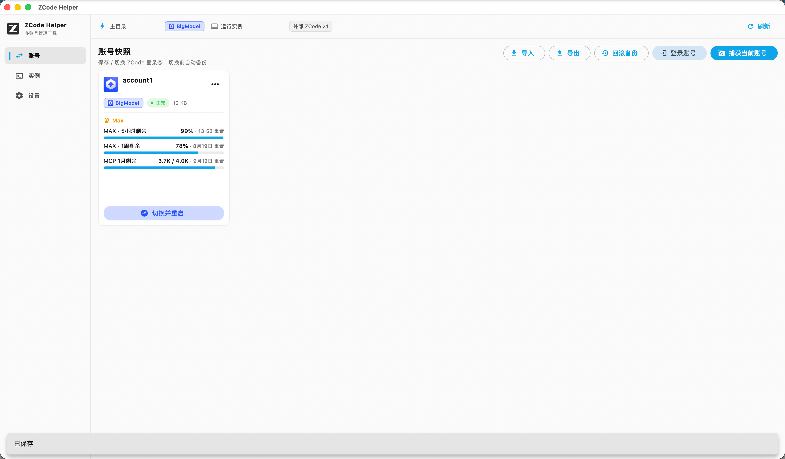

<div align="center">


# ZCode Helper

**Manage ZCode desktop accounts safely: login · snapshots · one-click switching · quotas · multi-instance**

[English](README.en.md) · [简体中文](README.md)

[](https://github.com/chenrensong/zcode-helper/actions/workflows/build.yml)
[](../../releases)
[](#installation)
[](#build-from-source)
[](LICENSE)

</div>

---

## Why

The ZCode desktop client only keeps one login at a time. If you use multiple accounts (team / personal, Z.ai global and BigModel China), every switch means logout → browser OAuth → client restart — and quota info is scattered across different pages.

ZCode Helper turns all of that into a single click:

- **No repeated logins** — save each account's login state as an encrypted snapshot and switch anytime;
- **Quotas in one place** — Coding Plan usage, balance and tier, normalized in a single view;
- **Zero setup** — reads and writes the official ZCode data directory (`~/.zcode/v2`) directly; no permission prompts, no patching ZCode itself.

Native Flutter app: no Electron, no bundled services, no telemetry. Your data never leaves your machine.

## Features

| | Feature | Details |
| --- | --- | --- |
| 🔐 | **Built-in OAuth login** | Dual providers: **Z.ai (global, chat.z.ai)** and **BigModel (China, bigmodel.cn)**; automatic loopback callback after browser authorization, with manual code paste as fallback; BigModel logins auto-derive a coding-plan key |
| 📸 | **Account snapshots** | Capture the current login state (`credentials.json` + `config.json`) into an encrypted local snapshot; rename, note, delete, import / export |
| 🔄 | **Safe one-click switching** | Backup → atomic write → cache cleanup → automatic ZCode restart, with staged progress; BigModel accounts are normalized to the native cached-profile (v2) format |
| 📊 | **Quota queries** | BigModel quota/limit API first, Z.ai usage & billing as fallback; normalized usage percentage, balance, plan tier and reset time |
| 🧱 | **Multi-instance** | Each instance gets a fully isolated data directory (HOME redirection on macOS, `ZCODE_DESKTOP_HOME_DIR` on Windows), optionally bound to a specific account snapshot |
| ⏪ | **Rollback** | Every switch backs up the previous state to `~/.zcas/.last`; one-click restore |
| 🩺 | **Health checks** | Detects expired tokens, corrupted credentials and duplicate accounts |

## Screenshots



## Installation

Grab the latest build from [**Releases**](../../releases) (automatically produced by CI on every tag):

| Platform | File | Requirements |
| --- | --- | --- |
| macOS | `zcode-helper-macos-v<version>.zip` (e.g. `zcode-helper-macos-v1.0.1.zip`) | macOS 12+, Apple Silicon / Intel |
| Windows | `zcode-helper-windows-v<version>.zip` (e.g. `zcode-helper-windows-v1.0.1.zip`) | Windows 10+ x64 |

**Verify integrity**: each Release ships a `SHA256SUMS.txt` (sha256 of every zip). Compare after downloading:

```bash
# macOS
shasum -a 256 zcode-helper-macos-v1.0.1.zip
# Windows (PowerShell)
Get-FileHash zcode-helper-windows-v1.0.1.zip -Algorithm SHA256
```

**macOS first launch**: CI builds are not Developer ID signed, so Gatekeeper will block them. After unzipping to `/Applications`, run:

```bash
xattr -cr /Applications/zcode_helper.app
```

**Windows**: unzip and run `zcode_helper.exe`; if SmartScreen warns, choose "Run anyway".

## Quick Start

1. **Login** — click "Login" on the Accounts page, pick Z.ai or BigModel; the browser flow captures a snapshot automatically;
2. **Switch** — click "Switch" on any account card; Helper quits ZCode safely, writes the target account and restarts — a few seconds in total;
3. **Quotas** — refresh plan usage / balance right on the account card.

Multi-instance: create an instance on the Instances page → (optionally) bind a snapshot → launch. Instances have isolated login state and caches.

## How It Works

### Data locations

| Path | Purpose | Access |
| --- | --- | --- |
| `~/.zcode/v2/` | Official ZCode login state (`credentials.json` / `config.json` / `setting.json`) | read / write (on switch) |
| `~/.zcas/accounts/` | Snapshot store (`<id>.meta.json` + `<id>.snap.json`) | read / write |
| `~/.zcas/.last/` | Backup of the pre-switch login state | read / write |

> ZCode clients (any version using the `~/.zcode/v2` credential layout) only use this layout — this app matches it exactly.

### Switch pipeline

```
detect provider ──► normalize BigModel profile ──► fix config provider section
                                                       (derive coding-plan key)
        ▼
safely quit the main client (instances untouched; aborts on timeout)
        ▼
backup current state ──► atomic write ──► clear coding-plan cache ──► relaunch ZCode
```

Writes are atomic (temp file + rename); any failure keeps the pre-switch state intact, restorable from `.last`.

### Snapshot encryption

Sensitive fields use the ZCode client's own `enc:v1` format: **AES-256-GCM**, 12-byte nonce, 16-byte auth tag, base64url; the key is derived from local machine identity (platform + home dir + username), so snapshots cannot be decrypted off your machine. The test suite includes a Node-generated cross-implementation fixture to guarantee byte-level compatibility.

## Security & Privacy

- **Local only**: account data stays on disk; network calls go exclusively to official Z.ai / BigModel endpoints.
- **No telemetry** of any kind.
- **OAuth callback**: listens on a random `127.0.0.1` port only, closed immediately after authorization.
- **Minimal entitlements** (macOS): just `network.client` (z.ai / bigmodel.cn) and `network.server` (127.0.0.1 loopback).
- See [SECURITY.md](SECURITY.md) for reporting security issues.

## FAQ

**Is switching lossless?**
Yes. The current state is fully backed up to `~/.zcas/.last` before every switch and can be restored anytime. ZCode's own data (tasks, logs) is untouched.

**Is this affiliated with ZCode?**
No. This is a community tool that reads/writes ZCode client files on your machine. You use it at your own risk.

**How do I uninstall completely?**
Delete `/Applications/zcode_helper.app` (or the Windows folder) and `~/.zcas`. `~/.zcode` belongs to the ZCode client and keeps working.

**Is the on-disk format compatible with the earlier Electron tool?**
Yes — `.zcas` store layout, `enc:v1` encryption, `.last` backups and BigModel native profiles are all interchangeable.

## Build from Source

```bash
git clone https://github.com/chenrensong/zcode-helper.git
cd zcode-helper
flutter pub get

flutter analyze   # static analysis
flutter test      # unit / widget tests

flutter build macos --release    # output: build/macos/Build/Products/Release/zcode_helper.app
flutter build windows --release  # output: build/windows/x64/runner/Release/zcode_helper.exe
```

For macOS distribution, `scripts/build_dev.sh 'Developer ID Application: ...'` applies a Developer ID signature.

## Contributing

Issues and PRs are welcome — see [CONTRIBUTING.md](CONTRIBUTING.md). Changes to crypto / switching code must keep `flutter test` green (including the cross-implementation crypto fixtures).

## License

[MIT](LICENSE) © 2026 ZCode Helper Contributors
