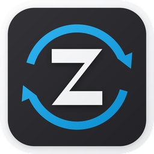

<div align="center">



# ZCode Helper

**安全管理 ZCode 桌面端账号：登录 · 快照 · 一键切换 · 额度 · 多开**

[简体中文](README.md) · [English](README.en.md)

[](https://github.com/chenrensong/zcode-helper/actions/workflows/build.yml)
[](../../releases)
[](#安装)
[](#从源码构建)
[](LICENSE)

</div>

---

## 为什么需要它

ZCode 桌面端一次只能登录一个账号。如果你同时使用多个账号（团队号 / 个人号、Z.ai 全球区与 BigModel 中国区），每次切换都要退出登录、重新走一遍浏览器 OAuth、再等客户端重启——额度也分散在不同页面，看不直观。

ZCode Helper 把这一切变成一次点击：

- **不用反复登录**——把每个账号的登录态保存为加密快照，随时一键切换；
- **不用到处查额度**——Coding Plan 用量、余额、档位在一个界面里统一展示；
- **不用配置任何环境**——直接读写 ZCode 官方数据目录（`~/.zcode/v2`），无需授权弹窗、无需改 ZCode 本身。

原生 Flutter 实现，无 Electron、无捆绑服务、无遥测，所有数据只留在本机。

## 功能

| | 功能 | 说明 |
| --- | --- | --- |
| 🔐 | **内置 OAuth 登录** | 支持 **Z.ai（全球区，chat.z.ai）** 与 **BigModel（中国区，bigmodel.cn）** 双体系；浏览器授权后经本地 loopback 回调自动完成，无法自动跳转时可手动粘贴授权码；BigModel 登录后自动派生 coding-plan key |
| 📸 | **账号快照** | 一键捕获当前登录态（`credentials.json` + `config.json`）为本地加密快照；支持重命名、备注、删除、导入 / 导出 |
| 🔄 | **一键安全切换** | 切换前自动备份 → 原子写入 → 清理缓存 → 自动重启 ZCode，全程分阶段进度提示；BigModel 账号自动标准化为 ZCode 原生 profile（v2） |
| 📊 | **额度查询** | BigModel quota/limit 接口优先，Z.ai usage、billing 兜底；归一化展示用量百分比、余额、计划档位与重置时间 |
| 🧱 | **多开实例** | 为每个实例分配完全隔离的数据目录（macOS 重定向 `HOME`，Windows 使用 `ZCODE_DESKTOP_HOME_DIR`），可绑定指定账号快照，实例与主客户端互不干扰 |
| ⏪ | **回滚备份** | 每次切换前自动备份到 `~/.zcas/.last`，可一键恢复到切换前的登录态 |
| 🩺 | **健康检查** | 识别过期令牌、损坏凭据、重复账号等问题并给出摘要 |

## 界面预览

> 🚧 截图整理中，将放置于 `docs/screenshots/`（账号页 / 实例页 / 登录流程）。

## 安装

从 [**Releases**](../../releases) 下载 CI 自动构建的最新版本（每次打 tag 自动出包）：

| 平台 | 文件 | 要求 |
| --- | --- | --- |
| macOS | `zcode-helper-macos-v<版本>.zip`（如 `zcode-helper-macos-v1.0.1.zip`） | macOS 12+，Apple Silicon / Intel |
| Windows | `zcode-helper-windows-v<版本>.zip`（如 `zcode-helper-windows-v1.0.1.zip`） | Windows 10+ x64 |

**校验完整性**：Release 附带 `SHA256SUMS.txt`（每个 zip 的 sha256）。下载后可比对：

```bash
# macOS
shasum -a 256 zcode-helper-macos-v1.0.1.zip
# Windows (PowerShell)
Get-FileHash zcode-helper-windows-v1.0.1.zip -Algorithm SHA256
```

**macOS 首次打开**：CI 构建没有 Developer ID 签名，Gatekeeper 会拦截。解压到 `/Applications` 后执行：

```bash
xattr -cr /Applications/zcode_helper.app
```

**Windows**：解压后直接运行 `zcode_helper.exe`；若 SmartScreen 提示，选择「仍要运行」。

## 快速上手

1. **登录** —— 账号页点击「登录」，选择 Z.ai 或 BigModel，浏览器完成授权后自动捕获为账号快照；
2. **切换** —— 在账号卡片上点击「切换」，Helper 会安全退出 ZCode → 写入目标账号 → 自动重启，全程约几秒；
3. **查额度** —— 账号卡片上直接刷新该账号的 plan 用量 / 余额，无需切过去再看。

多开：实例页「新建实例」→（可选）绑定一个账号快照 → 启动。实例拥有独立的登录态与缓存目录，与主客户端完全隔离。

## 工作原理

### 数据位置

| 路径 | 用途 | 操作 |
| --- | --- | --- |
| `~/.zcode/v2/` | ZCode 官方登录态（`credentials.json` / `config.json` / `setting.json`） | 读 / 写（切换时） |
| `~/.zcas/accounts/` | 本应用的账号快照库（`<id>.meta.json` + `<id>.snap.json`） | 读 / 写 |
| `~/.zcas/.last/` | 最近一次切换前的登录态备份 | 读 / 写 |

> ZCode 客户端（使用 `~/.zcode/v2` 登录态布局的版本）自身只使用 `~/.zcode/v2` 这一种布局，本应用与其完全对齐。

### 切换流水线

```
检测 provider ──► 标准化 BigModel profile ──► 修复 config provider 段
     │                                            （派生 coding-plan key）
     ▼
安全退出主客户端（仅主客户端；实例进程不受影响，超时则中止）
     ▼
备份当前登录态 ──► 原子写入目标账号 ──► 清理 coding-plan 缓存 ──► 自动重启 ZCode
```

写入使用「临时文件 + rename」的原子方式；任何一步失败都会保留切换前状态，可从 `.last` 一键回滚。

### 快照加密

快照中的敏感字段沿用 ZCode 客户端自己的 `enc:v1` 格式：**AES-256-GCM**，12 字节 nonce、16 字节 auth tag、base64url 编码；密钥由本机身份（平台 + home 目录 + 用户名）派生，因此快照离开你的机器无法解密。测试套件内置由 Node 实现生成的跨语言加密夹具，保证与客户端字节级兼容。

## 安全与隐私

- **纯本地**：账号数据只存于本机磁盘，不经过任何第三方服务器；网络请求仅访问 Z.ai / BigModel 官方登录与额度接口。
- **无遥测**：不收集、不上报任何使用数据。
- **OAuth 回调**：仅监听 `127.0.0.1` 随机端口的 loopback，授权完成即关闭。
- **最小权限**（macOS）：entitlements 只保留 `network.client`（访问 z.ai / bigmodel.cn）与 `network.server`（127.0.0.1 回调）。
- 发现安全问题请参见 [SECURITY.md](SECURITY.md)。

## FAQ

**切换会丢数据吗？**
不会。切换前当前登录态会完整备份到 `~/.zcas/.last`，任何时候都可以在账号页「回滚备份」。ZCode 自身的数据（任务、日志等）不受影响。

**和 ZCode 官方是什么关系？**
无任何关系。这是一个社区第三方工具，直接读写 ZCode 客户端在本机的数据文件。使用本工具产生的任何账号风险由使用者自行承担。

**怎么完全卸载？**
删除 `/Applications/zcode_helper.app`（或 Windows 的程序目录）和 `~/.zcas` 即可。`~/.zcode` 属于 ZCode 客户端，Helper 卸载后不影响其正常使用。

**磁盘格式与旧版 Electron 工具兼容吗？**
兼容。`.zcas` 账号库结构、`enc:v1` 加密、`.last` 备份目录与 BigModel 原生 profile 均保持一致，可互相导入。

## 从源码构建

```bash
git clone https://github.com/chenrensong/zcode-helper.git
cd zcode-helper
flutter pub get

flutter analyze   # 静态检查
flutter test      # 单元 / 组件测试

flutter build macos --release    # 产物: build/macos/Build/Products/Release/zcode_helper.app
flutter build windows --release  # 产物: build/windows/x64/runner/Release/zcode_helper.exe
```

macOS 分发可用 `scripts/build_dev.sh 'Developer ID Application: 你的身份'` 做 Developer ID 签名。

## 贡献

欢迎 Issue 与 PR，参见 [CONTRIBUTING.md](CONTRIBUTING.md)。改动加密 / 切换相关代码时，请务必保证 `flutter test` 全绿（含跨语言加密夹具测试）。

## License

[MIT](LICENSE) © 2026 ZCode Helper Contributors
